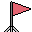
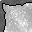
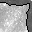

# rytour
This game is my project for Open Jam 2019.  

  
  

This is a platformer game in which you play as a moon robot. This is the first game jam I've participated in,
and rytour is the first game I've made with (non-ASCII) graphics. Given that, I think it turned out well, and was a fun and educational experience.  

Space images were in the public domain. Sprites were made by me, and the music
and sound effects were written and/or recorded by me, and are licensed with GPL3.  
Lastly, the included font, Ubuntu, is licensed under the Ubuntu Font License.  
All programming was done on Ubuntu 18.04.
  

## List of open tools used
### Development
- Geany
- GCC/G++
- SDL2
- Git  
### Sound
- Musescore
- Audacity  
### Graphics
- Pinta
- GIMP
  

